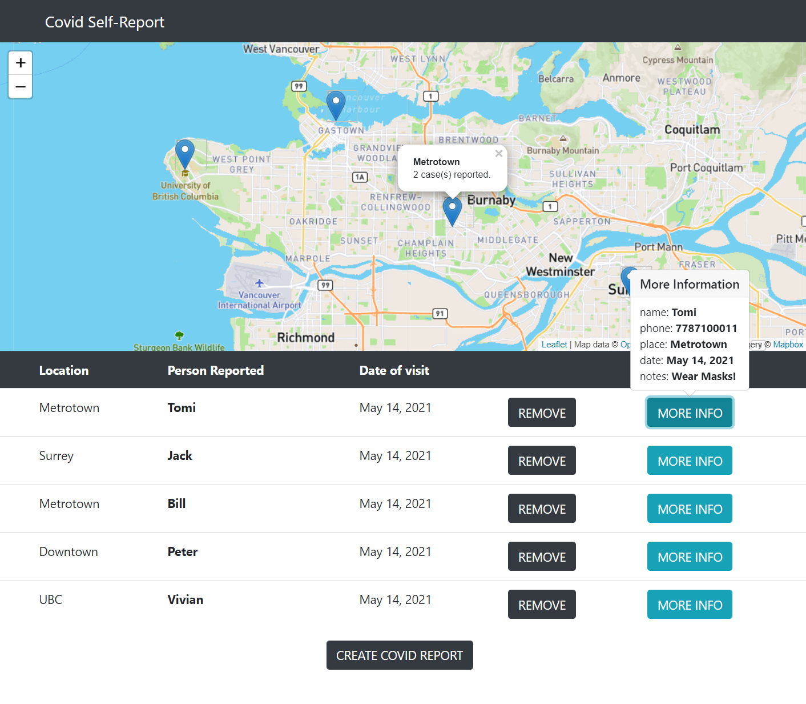
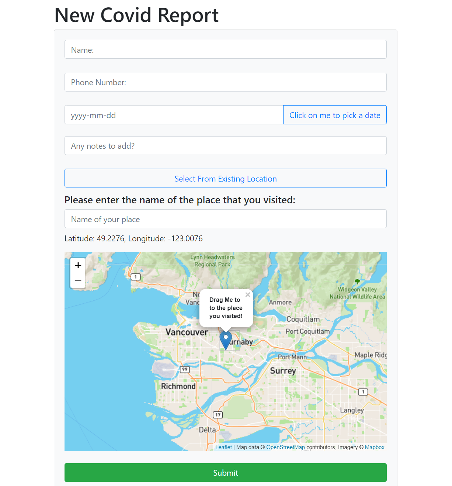

# Covid-19 Self Report App

### Project Description:

This application allows the COVID-19 infected community to self-register places that they have visited while possibly carrying the virus. The application will show location and tabular data on the movements of infected people by updating and retrieving data from a database.

### Technologies Used:

- Angular 11
- LeafLet Map API
- External Database

to run this Angular web application, `cd` into the `App` directory and run:

`npm install` then run: `ng serve`.

### Landing Page

The main page shows the locations that the users have travelled to, and their information.

### Create a Covid-19 Report Form

This form allows the user to enter their personal information and drop a pin on the location they visited or select a existing location.

